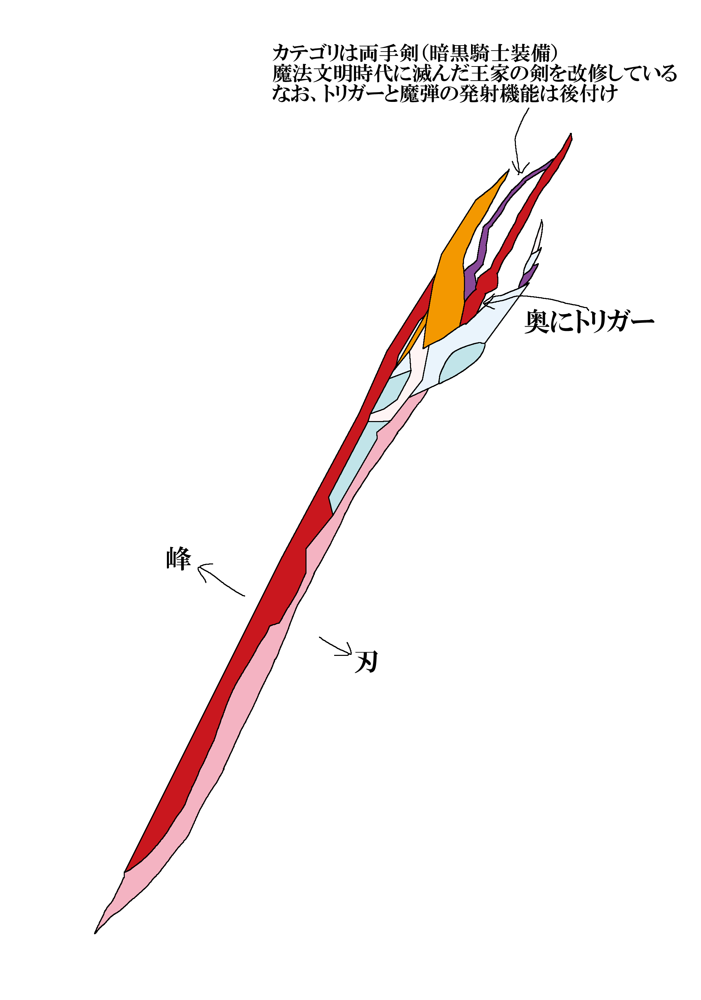

# 必要立ち絵・差分リスト（2025/03/09現在）

- [x] イリヤスフィール・ゼーゲブレヒト（Lap2-6）  
  基本的に、Fate/kaleid liner プリズマ☆イリヤ ツヴァイ ヘルツ！におけるイリヤスフィール・フォン・アインツベルンのFF14（暗黒騎士）アレンジ。  
  衣装ベースはツヴァイフォームだが、暗黒騎士なので光の翼はない（むしろ光の翼は白魔の領分である。テンパランス的な意味で）。
  - [x] 喜怒哀楽（表情差分）
    - 目差分
    - 口差分
    - 眉差分
    - 顔色差分
  - [x] 武器構え差分
    - 武器に関して言えば「配色が違うだけのディヴァインライト・グレートソード」。青部分がピンク系統になっている。
  - [x] 影身差分
    - 原作と同様、「英雄の影身（フレイ・ミスト）」とほぼ同デザイン。武器もデスブリンガー系のデザインであっている。
  - [x] 影身差分2
    - フレイ君（英雄の影身）がジョブクエストにおいて、主人公と同じ見た目で登場したことに由来。ただし、こちらは目の色をクロエ風に調整するだけの簡素なものとする。
- [x] 不動遊星（Lap2-4）  
  アーククレイドル～5D'sラストデュエルと同じ見た目。
  - [x] 喜怒哀楽（表情差分）
    - 目差分
    - 口差分
    - 眉差分
    - 顔色差分
  - [x] ゴールドレア差分（リミットオーバーアクセルシンクロ）
- [ ] TRExLap2-4内のID「加速同期 シンクロン・エクストリーム」内のボスすべて
  - [リンク](https://strayed.site/ytsheet2/sw2.5trex-ng1/?type=m&tag=Lv3ID%e3%81%9d%e3%81%ae1 "Lv3IDその1")
- [x] 残影のエクセリア（Lap2-4）
  「炎影のクライヴ」と同じようなかんじ。これまでの「最果ての聖王エクセリア」と同一の外見だが、肌が黒かったり虹彩が白かったりする。
  - [x] 喜怒哀楽（表情差分）
    - 目差分
    - 口差分
    - 眉差分
    - 顔色差分
  - [x] 残り火状態差分
  - [x] 武器構え差分
- [x] リミットゲージ（Lap2-4）
- [ ] ニール／疑似銃神サバーニャ（Lap2-5）  
  顕現時の形態は「ガンダムサバーニャ（最終決戦仕様）」を纏ったニール・ディランディといった外見。
  - [ ] 喜怒哀楽（表情差分）
    - 目差分
    - 口差分
    - 眉差分
    - 顔色差分
  - [ ] 武器構え差分
    - GNピストルビット
    - GNライフルビットⅡ
    - GNライフルビットⅡ陣形（「乱れ撃つぜ！」直前）
    - GNライフルビットⅡ陣形（字で表すと「◇◇◇」のアレ）
  - [ ] トランザム差分
- [ ] アレルヤ／ハレルヤ／疑似轟神ハルート（Lap2-5）  
  顕現時の形態は「ガンダムハルート（最終決戦仕様）」。思いっきり形態が変化する類
  - [ ] （アレルヤのみ）喜怒哀楽（表情差分）
    - 目差分
    - 口差分
    - 眉差分
    - 顔色差分
  - [ ] （ハルート）武器構え差分
  - [ ] （ハルート）トランザム差分
  - [ ] （ハルート）マルートモード差分
- [x] ~~ガンダム・バルバトスルプスレクス（Lap2-5）~~
  - 武器構え差分
- [x] ~~機皇帝ワイゼル∞（Lap2-5）~~
- [x] ［カットシーン］疑似氷神シヴァ／セイヴァー登場シーン（Lap2-5）
  ```plaintext
  [カットシーン進行]
  1. バックは大氷原
  2. 最初は素の疑似氷神シヴァ
  3. 飛来してきたザンライザーと疑似氷神シヴァがドッキング(ドッキング方式はダブルオーザンライザーと同じ)
  4. 青色のエフェクトを伴いつつセブンソード/G部分も形成
  5. GNバスターソードⅡが展開してGNフィールド展開、明朝体のテロップ出現
  6. 氷の剣を形成して戦闘開始

  こんだけ
  ```
- [x] メイナ・メイルシュツルム（Lap2-4他）
  - [x] 喜怒哀楽（表情差分）
    - 目差分
    - 口差分
    - 眉差分
    - 顔色差分
  - [x] 装備差分  
    白魔と巫覡を兼任する都合上、AF等に差分が設けられる。
    - 白魔道士AF（暁月AF: シアファニー一式+パームクルーク（両手幻具））
    - 巫覡AF（オプションアイテム: 東方女学生一式（胴部分白染め、袴部分赤染め）+『「千鶴」村正+大太刀「」』（双刀））
  - [x] 武器構え差分
    - パームクルーク（両手幻具：製作）
    - 「千鶴」村正+大太刀「」（双刀：アーティファクト装備）
- [ ] グラスランナーの男 (Lap2-6他)  
  FF14の実況／攻略解説者「ぬけまる」氏のキャラにガワだけ類似した（緑髪赤眼の）グララン。衣装はFF14の[「グリーナーズ」一式](https://ff14-fc.com/equipment/gleaners/ "グリーナーズ一式")。  
  グラランの立ち絵少ないのでやむを得ず。
- [ ] シューティング・スター・ドラゴン (Lap2-6、Lap2-7他)  
  他にいろいろと使うので差分付き。
  - [ ] アカシア化 ([全体的に青みがかった外見になる差分](https://img.gamewith.jp/article/thumbnail/rectangle/405475.png "参考: アカシックモルボル"))
- [ ] 黒の剣士 (Lap2-6他)  
  イメージ的には、「全滅の後に、祝福無き者として成長したヒューガ」なので、わりと老けたような外見にする。
  更に、顔は黒い靄で何も見えない。
  - [ ] 武器構え差分
- [ ] “知啓の水瓶”アルトゥール・フォン・バイエルン (Lap2-6他)  
  小壺を被っただけの全裸の男。武器を持っている＆下半身は下着で隠れているので完全な全裸ではない。
  - [ ] 喜怒哀楽 (表情差分)
    - 目差分
    - 口差分
    - 眉差分
    - 顔色差分
  - [ ] 武器構え差分
    - 猛禽の鉤爪
    - 竜餐の印
  - [ ] 能力発動差分  
    竜餐絡みで使用。
    - グレイオール
    - エグズキス
    - プラキドサクス
- [ ] ジャック・ニコラス・トニトルス (Lap2-6他)  
  種自由のシュラみたいな顔つきの祝福無き者(ソレイユ想定)。
  武器は[両手斧](https://attire.jp/wp-content/uploads/2023/07/ffxiv_20230721_142427_293.jpg "参考: バルディッシュ・オブ・アセンション")で、防具は[ディフェンダーメイル・オブ・アセンションを主軸とする](https://attire.jp/wp-content/uploads/2023/07/ffxiv_20230712_084956_931.jpg)。
  アンドレアのように亡者化はしていない。
  - [ ] 喜怒哀楽 (表情差分)
    - 目差分
    - 口差分
    - 眉差分
    - 顔色差分
  - [ ] 武器構え差分
- [x] ~~スターダスト・アサルト・ウォリアー~~
- [x] ~~スターダスト・チャージ・ウォリアー~~
- [x] 光に佇む淑女／ヴェーネス(FF14) (Lap2-7他)  
  先行して登場するため。
  - [x] 喜怒哀楽 (表情差分)
    - 目差分
    - 口差分
    - 眉差分
    - 顔色差分
  - [x] 武器構え差分  
    オールラウンダーであるため、「片手剣+盾(ナイト)」「両手幻具(白魔道士)」「投擲武器(踊り子)」の差分あり
    - [ディヴァインライト・バスタードソード](https://jp.finalfantasyxiv.com/lodestone/playguide/db/item/4557c74beaa/)+[ディヴァインライト・シールド](https://jp.finalfantasyxiv.com/lodestone/playguide/db/item/c4eb6b9d88d/)
    - [ディヴァインライト・タスラム](https://jp.finalfantasyxiv.com/lodestone/playguide/db/item/3dbb906104f/)
    - [ディヴァインライト・ケーン](https://jp.finalfantasyxiv.com/lodestone/playguide/db/item/6799bba0cf6/)
- [ ] 聖珖神竜スターダスト・シフル (Lap2-7)
- [x] ジョブアイコン：巫覡  
  ジョブアイコン(64x64)の中央を左上から右下にかけて斜めに分割するようなレイアウト  
  右上にかけて桜の花のような線  
  左下にかけて、双刀がモチーフの線  
  中央には、人魂のような細長い炎がモチーフの線  
  DPSなので背景色は赤、線の色は金。細かな仕様は[FF14ファンキット](https://jp.finalfantasyxiv.com/lodestone/special/fankit/icon/)を参照。
- [x] 船頭のデヴィッド (Lap2-9)  
  ヒトガタのムフェト・ジーヴァイメージ  
  装備はテオゴニアー・ディフェンダー一式
  - [x] 喜怒哀楽差分 (表情差分)
    - 目差分
    - 口差分
    - 眉差分
    - 顔色差分
- [x] ジェシカ・サージェント・ナインテールズ (Lap2-9)  
  FF16の「ヴィヴィアン・ナインテールズ」相当の軍事学者。  
  ただし、装備はエデンモーン・ヒーラー一式。
  - [x] 喜怒哀楽差分 (表情差分)
    - 目差分
    - 口差分
    - 眉差分
    - 顔色差分
- [x] 鍛冶師のアンドレイ (Lap2-9)  
  概ね「ダークソウル3」のアンドレイに外見的特徴は一致。  
  ただし、「種族はドワーフ」である。
  - [x] 喜怒哀楽差分 (表情差分)
    - 目差分
    - 口差分
    - 眉差分
    - 顔色差分
  - [x] 鍛冶作業差分
- [x] 物売りのエミリア (Lap2-9)  
  立ち絵の外見は、書籍「ALLグララン総進撃！」におけるPC「ゾーラ」と一致するが、  
  装備はゾーモー・キャスター一式。
  - [x] 喜怒哀楽差分 (表情差分)
    - 目差分
    - 口差分
    - 眉差分
    - 顔色差分
- [x] スチュアート・スミス (Lap2-9)  
  立ち絵の外見は概ね漆黒編までのアルフィノと同じ。
  - [x] 喜怒哀楽差分 (表情差分)
    - 目差分
    - 口差分
    - 眉差分
    - 顔色差分
- [ ] トランスグレサー・ティフォン (Lap2-9)  
  使わない可能性もあるので現状保留
- [x] ~~殲滅機構オールバニッシャー・プロト~~
- [x] エクセリア・シャルロッテ・クレア・ゼーゲブレヒト・アウェア (Lap2-9以降の新装版)  
  第9話以降の新規立ち絵。「最果ての聖王」ベースに、「残影のエクセリア」と同じ絵柄にリアレンジ。  
  武器を持っていない（＝左右両腰の鞘に、それぞれの剣が収められている状態の）差分の他、新規表情差分が追加されている。
  - [x] 喜怒哀楽差分 (表情差分a)
    - 目差分
    - 口差分
    - 眉差分
    - 顔色差分
  - [x] 特殊表情差分 (表情差分b)
    - 残火再燃(リミットブレイク)時の青色発光 (目差分)
    - 飯を食っている差分 (口差分+α)
      - 唐揚げなど、1個の大きさが小さめの調理品 (頬張っている差分)
      - サンドイッチなどの手で持つ調理品 (かじっている差分。腕への追加差分が必要)
      - ステーキなどのわりと大きな調理品 (かじっている差分。腕への追加差分は不要)
    - 「あ゛？」と言った具合の「呆れ差分」 (目・口・眉への一括差分)
    - 挑発(～Lap2-8までの、旧立ち絵の残り火版にのみあった、「煽っている」ような差分のこと) (目・口・眉への一括差分)
  - [x] 武器抜刀差分
    - 抜刀YM (結月と月光を抜刀して構えた差分)
    - 抜刀HA (予備武器の「骨喰【絶】」と「アイスクーネRE」を抜刀して構えた差分。結月や月光(刃長およそ6尺(約1.8m)程度)の4分の1程度の長さしかない)
  - [x] 納刀状態の武器・道具の描写  
    予備武器をいくつか装備している。  
    各武器はレイヤー分けによって表示・非表示が可能。  
    「武器名(刃渡り+用途): 装備位置」
    - 結月 (6尺／約180cm): 左腰下
    - 月光 (6尺／約180cm): 右腰下
    - 骨喰【絶】 (1.5尺／約45cm、予備武器): 左腰上
    - アイスクーネRE (1.5尺／約45cm、予備武器): 右腰上
    - エデンコーラス・ダガー (長くても0.5尺／約15cm程度、魔物の解体用の道具): 左腰、残影版の場合、裾で見えなくなる部分(腰ベルトに提げている)
  - [x] 瀕死差分 (出血・ひび割れはなし)
- [ ] テミス (Lap2-10)  
  FF14の万魔殿パンデモニウムに登場するアイツ。CV石田彰。
  - [ ] 喜怒哀楽差分 (表情差分)  
    武器構え差分なんてねぇのです。
    - 目差分
    - 口差分
    - 眉差分
    - 顔色差分
- [x] 神城まどか (Lap2-10)  
  大まかな顔のパーツや髪型はエクセリアと同じだが、衣服が「青い桜模様の着物」で、「銀髪赤眼」。  
  また、巫覡ではなく、敵対NPC。
  - [x] 衣服差分
    - 青い桜模様の着物 (通常)
    - アルティメットまどか (リズン)
    - 比村氏アチャ子風の赤い外套 (英傑まどか)
  - [x] 喜怒哀楽差分 (表情差分a)  
    - 目差分
    - 口差分
    - 眉差分
    - 顔色差分
  - [x] 特殊表情差分 (表情差分b)  
    非常に厄介な差分あり
    - アンテのCharaのGルート最終盤のあの表情
  - [x] 武器構え差分  
    - 漆黒の刀(デザイン的には[彼岸此岸【妖】](https://jp.finalfantasyxiv.com/lodestone/playguide/db/item/5180227783e/)の漆黒版)
    - まどかの弓
  - [x] 瀕死差分
- [ ] マドカ・プライム (Lap2-21)/ジェミニオン・レイ (その他)  
  神城まどかが顕現(？)した形態。ほぼジェミニオン・レイそのまんまな形態になっている。
  - [ ] カメラアイ発光差分
    - 橙 (ジェミニオン・レイ)
    - 赤 (マドカ・プライム)
  - [ ] 武器構え差分  
    武装演出を参照。
    - フルアクセルグレイブ (両腰の剣。武装では「バルムンク・エリミネーション」を参照)
    - エネルギーソード (「ジ・オーバーライザー・アーク」を参照)
  - [ ] スフィア発光差分: 胸元が光る。
- [ ] シューティング・セイヴァー・スター・ドラゴン／ベルリオーズ (Lap2-11)  
  外見はほぼ同じだが、ベルリオーズという個体名と同時にいくつか装備品が追加されている。
  - [ ] 喜怒哀楽差分？ (表情差分)  
    あれ表情出せるのか？なくても可
  - [ ] 装備構え差分  
    一応モーエンツール(最終段階)を装備している。
    - [ロードスター・クロスペインハンマー](https://jp.finalfantasyxiv.com/lodestone/playguide/db/item/d55d1338b13/)
    - [ロードスター・レイジングハンマー](https://jp.finalfantasyxiv.com/lodestone/playguide/db/item/3ed62c248d8/)
    - [ロードスター・マレット](https://jp.finalfantasyxiv.com/lodestone/playguide/db/item/454df0a0e26/)
- [ ] アンドリアス (Lap2-12)  
  大まかな外見は進撃の巨人の「終尾の巨人」だが、そんなにデカくない。
- [ ] アストレイド・ピッカー (Lap2-12)  
  大まかな外見はFF14の罪喰い (フォーギヴン・＊＊＊系)と同じ。
  - [ ] 武器構え差分
- [ ] イング＝シゲル (Lap2-13)  
  大まかな外見は、「第2次スーパーロボット大戦Z破界編」などに登場した「トライア・スコート」に類似。耳はアマルテイアなので尖っている。
  - [ ] 喜怒哀楽差分 (表情差分a)
    - 目差分
    - 口差分
    - 耳差分 (テンションに応じて耳が若干あがったりさがったり)
    - 眉差分
    - 顔色差分
  - [ ] 狐面かぶり差分 (表情差分b)  
    いわゆる特殊表情差分。
- [ ] 穴開けの少年 (Lap2-13)  
  グレンラガン最終話のエピローグに登場する少年がモチーフの、“少年期のエメトセルクの父親”。
- [ ] ヒュペリオン (Lap2-13)  
  暖色ベースの天元突破したラフトクランズ・ファウネア。
  - [ ] 喜怒哀楽差分
    - 顔色差分 (機械ベースの顔なので正直目差分とかつけようがねぇのです)
  - [ ] 武器構え差分  
    [シャスティフォル](https://jp.finalfantasyxiv.com/lodestone/playguide/db/item/9771bef8cfb/)を装備している。
- [ ] クライヴ・ロズフィールド (Lap2-13)
  - [ ] 喜怒哀楽差分 (表情差分a)
    - 目差分
    - 口差分
    - 眉差分
    - 顔色差分
  - [ ] 特殊表情差分 (表情差分b)
    - 吐出差分 (口差分)
      - キラキラ (＝ゲロ)
      - 血 (※瀕死差分などで追加使用)
    - SAN値直葬差分  
      失禁などの下品差分はなし。滝汗は後述するため省略可。
      - ニンジャリアリティショック(一括差分)
      - マジでヤバいやつを見たときの表情(一括差分)
      - 台詞で表すなら「何なのだ、これは！どうすればいいのだ？！」(一括差分)
    - 滝汗 (エフェクト差分)
  - [ ] 武器構え・納刀差分
    - インヴィクタスか、[FF14の片手剣カテゴリのうち、どれか描きやすそうなやつ](https://jp.finalfantasyxiv.com/lodestone/playguide/db/item/?category2=1)
  - [ ] 半顕現差分
  - [ ] 瀕死差分
- [ ] 雪月花のマルグリット (Lap2-14共通)  
  マルグリット・ピステール(SRWZ2)とほぼ同じ外見
  - [ ] 喜怒哀楽差分 (表情差分)
    - 目差分
    - 口差分
    - 眉差分
    - 顔色差分
- [x] システィナ・フュルスティン・アウェア (Lap2-14a)  
  DSTRV(暗い魂の探索紀行RV)におけるPC「システィナ」、DSTREA(暗い魂の探索紀行RE番外編)におけるPC「ソフィーナ」、およびDSTRV(暗い魂の探索紀行RV)における同名のPCと外見的特徴は一致する。
  苗字はアウェア家の傍流であるため、「爵位をミドルネームに置く」命名規則となっている。
  いわゆる新装版になるため、衣服が異なり、[MoEの『神巫セット』](https://scrapbox.io/medianmoe/%E7%A5%9E%E5%B7%AB%E3%82%BB%E3%83%83%E3%83%88)になっている。
  - [x] 喜怒哀楽差分 (表情差分)
    - 目差分
    - 口差分
    - 眉差分
    - 顔色差分
  - [x] 武器構え・納刀差分  
    [新都刀【改】](https://jp.finalfantasyxiv.com/lodestone/playguide/db/item/88af7d6dea5/)を2本装備。
  - [x] 瀕死差分
- [ ] エリック・J・ロウティエンス (Lap2-14a)  
  薄頭の男。外見の特徴はほぼフーゴ・クプカと同じだが、時系列な都合で別人。
  - [ ] 喜怒哀楽差分 (表情差分)
  - [ ] 武器(タイタン腕)構え差分
    - 振りかぶり前
    - タイタンブロック(タイタンの両腕を前に構える)
  - [ ] 半顕現差分
  - [ ] 瀕死差分
- [ ] ジル・ワーリック (Lap2-14b)  
  コスチューム：シヴァホワイトであることに留意
  - [ ] 喜怒哀楽差分 (表情差分)
    - 目差分
    - 口差分
    - 眉差分
    - 顔色差分
  - [ ] 武器構え・納刀差分  
    武器は[シヴァ・ダイアモンドデーゲン](https://jp.finalfantasyxiv.com/lodestone/playguide/db/item/945f209dbda/)を参照。
  - [ ] 半顕現差分
  - [ ] 瀕死差分
- [ ] 坂本信宏(ヴァルマーレ海軍幕僚長)  (Lap2-14b)  
- [ ] マティアス・トーレス (Lap2-14b)  
  ACE7のDLCで「ACの最新作に出てくる」「CV安元洋貴で」「元の組織を裏切り」「超デカイレールキャノンを借りパクした」「到底マトモとは思えない連中の首魁である」「様子のおかしい狂人」。  
  だが、TREx上では「1000万人救済計画を思いつきはしたが、救うはずだった1000万人の10％に自然災害で被害が出たので実行しようとも思わなかった」というオチがついている。  
  ていうか配属予定の乗艦をジャスティン・ジェラードとかいうやつに盗まれた。  
  装備は[カザナル・レンジャー](https://ff14-fc.com/equipment/rakaznar_of_aiming/)だが、ヘッドギアを装備しない。
  - [ ] 喜怒哀楽差分 (表情差分a)
    - 目差分
    - 口差分
    - 眉差分
    - 顔色差分
  - [ ] 特殊表情差分 (表情差分b)
    - しわしわピカチュウ的なやつ (表情一括差分)
    - 台詞で表すなら「分からんか」 (表情一括差分)
    - 気迫または狂気 (表情一括差分)
  - [ ] 武器構え・納刀差分  
    メイン武器が複数種類あるが、シナリオ進行に応じて持ち替える。  
    サブ武器は、進行状況にかかわらず[**オートマグ44**](https://ja.wikipedia.org/wiki/%E3%82%AA%E3%83%BC%E3%83%88%E3%83%9E%E3%82%B0)であるため注意。
    - ～蒼天編まで：[モルフリッス・エウレカ](https://jp.finalfantasyxiv.com/lodestone/playguide/db/item/b992cb490d3/)
    - 紅蓮編～暁月編：[マンダヴィル・マジェスティック・ハンドガン](https://jp.finalfantasyxiv.com/lodestone/playguide/db/item/906e48852ce/)
    - 黄金編(Patch 7.0～7.1ID前)：[スタルマン・スペシャル](https://jp.finalfantasyxiv.com/lodestone/playguide/db/item/eadad8adaca/)
    - 黄金編(Patch 7.1ID後～)：[**エデンモーン・ハンドガン【絶】**](https://jp.finalfantasyxiv.com/lodestone/playguide/db/item/165a89d29a1/)
  - [ ] 瀕死差分  
    出血とぼろぼろはレイヤー分け。
- [x] セリーヌ・シャルロッテ・クレア・ゼーゲブレヒト・アウェア (Lap2-14e)  
  ノーブルヴァルキリー(古代種)の3歳児。ヴァルキリー亜種であるため、女性。  
  茶髪(赤色メッシュあり)赤眼、肌色は薄めのベージュ。髪型はアリゼー(暁月)みたいなかんじ。  
  親から継いだ形質として、「茶髪(父)」「赤眼(母)」「髪の毛に赤いメッシュ(母)」「肌の色(母)」が挙げられる。
  - [x] 基礎差分
    - 幼児(3歳児)版
    - 成人(20歳)版
      - 服装に関しては、FF14の「[東方美姫衣装](https://ff14-fc.com/equipment/far_eastern_maidens_attire/)」あたりが妥当？
  - [x] 喜怒哀楽差分 (表情差分a)
    - 目差分
    - 口差分
    - 眉差分
    - 顔色差分
  - [x] 特殊表情差分 (表情差分b)
    - 飯を食っている差分 (口差分): 内容自体はエクセリアのものと変化なし。
  - [x] 光の翼差分  
    ノーブルヴァルキリー古代種の特徴として、3対6枚の光の翼を持つ。
  - [x] 瀕死差分
  - [x] 武器構え・納刀差分  
    幼年仕様、成人仕様の両方とも、巫覡となっている。
    - [x] 幼年仕様(2パターン)
      - 木刀の二刀流。身の丈にあったサイズ
      - [氷神刀【改】](https://jp.finalfantasyxiv.com/lodestone/playguide/db/item/3af049f894d/)の二刀流。背丈より大きいため、背中に背負っている(それでも比率が4:7になるぐらいには大きい)
    - [x] 成人仕様
      - [氷神刀【改】](https://jp.finalfantasyxiv.com/lodestone/playguide/db/item/3af049f894d/)の二刀流。身の丈にあったサイズ
      - エクセリアが持つ双刀（結月と月光）の模造品。
- [ ] ゴッドフリー・ザルム (Lap2-14d)  
  渋いおっさん。
  - [ ] 喜怒哀楽差分 (表情差分)
    - 目差分
    - 口差分
    - 眉差分
    - 顔色差分
  - [ ] 兜差分
    - 通常
    - 静寂の使徒
  - [ ] 武器構え差分
    - 斬鉄剣
    - 斬鉄剣(折れ)←注：大斬鉄返し直後
- [ ] ファミル (Lap2-15)
  - [ ] 喜怒哀楽差分 (表情差分)
    - 目差分
    - 口差分
    - 眉差分
    - 顔色差分
  - [ ] 髪色差分
    - 偽装時の黒髪
    - “水の民”としての銀髪
- [ ] ハレク、マルネク (Lap2-15)  
  差分については、ファミルと同じ量が必要
- [ ] 煌衣纏いしシャガルマガラ (Lap2-15)  
  差分なし。
- [ ] 呪いの王、モルゴース (Lap2-15)
- [ ] 呪いの尖兵、ヴァージニア (Lap2-15)
  - [ ] 瀕死差分
  - [ ] 破損翼からの噴射差分
- [x] 魔動天使のリリアーナ (Lap2-15)  
  カルゾラルの魔動天使（表紙）のあの子。  
  ただし、徹頭徹尾FF14準拠の変更があり、防具（胴から下）は[アスフォデロース・ディフェンダーキトン](https://attire.jp/wp-content/uploads/2022/03/ffxiv_20220318_093657_392.jpg)である他、  
  頭にはエンジェルスフィアが存在する関係上、展開デザインが最も近い[クレデンダム・ディフェンダーサークレットRE](https://jp.finalfantasyxiv.com/lodestone/playguide/db/item/f7b428b4317/)がある。  
  ただし、衣服差分が存在する（そちらの場合は後述）
  - [x] 衣服差分
    - 通常（前述）
    - 部屋着スタイル  
      [ファットキャット装備](https://jp.finalfantasyxiv.com/lodestone/playguide/db/item/4f06758e8d1/)一式を着込んだ姿。でも鋼鉄の翼は畳んでも隠せない。
  - [x] 喜怒哀楽差分 (表情差分a)
  - [x] 特殊表情差分 (表情差分b)
    - 飯を食っている差分 (口差分)  
      内容自体はエクセリアのものと変化なし。
    - てへぺろ (一括差分)
    - ＞＜ (目差分)
    - 涙目 (目差分)
  - [x] 瀕死差分
  - [x] 翼の展開差分  
    普段は折りたたんでるのもいいよね
  - [x] 武器構え差分  
    わけあって換装しており、[ルベルクス・ソーバック](https://lds-img.finalfantasyxiv.com/accimg2/f6/ab/f6abc4f7bcee29ee7a7761ab171576cfaa47768a.jpg)を装備している。  
    魔動天使の初期技能を考慮すると、ガンブレイカーが最も近い。
- [ ] ブラック・ローズ・ドラゴン（ブラッド・ローズ・ドラゴン）、パワー・ツール・ドラゴン（ライフ・ストリーム・ドラゴン）、  
  スターダスト・ドラゴン、スカーレッド・ノヴァ・ドラゴン、イフリート・リズン（イフリート、フェニックス）  
  召喚士のジョブアクションにおいて、召喚するときに使用。  
  コズミック・クェーサー・ドラゴン（サモン・コズミック・クェーサー）、シューティング・セイヴァー・スター・ドラゴン（サモン・スターダストⅡ）は、  
  それぞれ「珖焔の召喚獣」「ベルリオーズ」から使い回す。
- [ ] カットシーン:Lap2-21  
  動画ではなく1枚絵。[参考動画](https://www.youtube.com/watch?v=fy049iWvJU0)
  - [ ] この剣を以て　次代の民の盾とならん
    参考動画の冒頭、クライヴの台詞「戦い続けるさ」～「この剣をもって　不死鳥の盾とならん」の流れを踏襲
  - [ ] フェニックスの力(コズミック・クェーサー・リズン顕現)  
    参考動画: 6分5秒～6分27秒  
    厳密にはアルテマが「この愚物が！」と言うあたり(顕現直後～戦闘開始前)。
  - [ ] ロベルタVSガルーダ、ラトレイアVSラムウ、キャンデロロVSタイタン(力のぶつかり合い1回目)  
    参考動画: 17分25秒～18分35秒  
    いずれも鍔迫り合い開始前、鍔迫り合い後の2差分あり
    - [ ] ロベルタ(鳥かごの魔女)VSガルーダ  
      ロベルタ側は、鳥かごが爪っぽくなっている  
      動画においてエクセリアに言葉をかける者はマティアス・トーレスであり「行くぞ相棒！」
    - [ ] ラトレイア(針の魔女)VSラムウ
      ラトレイア側は、鉤爪が雷を帯びている  
      動画においてエクセリアに言葉をかける者はテミスであり「僕達の祈りと共に！」
    - [ ] キャンデロロ(おめかしの魔女)VSタイタン
      キャンデロロ側は、リボンの拳  
      動画においてエクセリアに言葉をかける者はリリアーナであり「奴を地獄に叩き込め！」
  - [ ] クリームヒルトVSバハムート、オクタヴィアVSシヴァ、ホムリリィVSオーディン(力のぶつかり合い2回目)  
    - [ ] クリームヒルト(救済の魔女)VSバハムート  
      言わずもがなゲロビ合戦。クリームヒルト側のビーム色は桃色、エクセリア側のビーム色は金色  
      動画においてエクセリアに言葉をかける者はアンドレイであり「さすが我らが英雄！」
    - [ ] オクタヴィア(人魚の魔女)VSシヴァ  
      地面から氷柱が突き上げるだけ。かなしい  
      動画においてエクセリアに言葉をかける者はリーンであり「私も、精一杯祈りたいと思います」
    - [ ] ホムリリィ(此岸の魔女)VSオーディン  
      ホムリリィ側は闇を帯びた普通の刀。エクセリア側はFF16の斬鉄剣  
      動画においてエクセリアに言葉をかける者はベルリオーズであり「娘よ、前に進め！」
  - [ ] リミットブレイク後・イマジナリサジタリウスVSフェニックス+アルテマ  
    イマジナリサジタリウスはジェミニオン・レイの翼1対2枚。エクセリア側は、フェニックスの赤い翼+アルテマの青白い翼×2の3対6枚  
    動画においてエクセリアに言葉をかける者はアルテマであり「永劫に続け」
  - [x] この世界を“最後の幻想”にしてくれる！→“究極の幻想”を打ち破る  
    刀投擲前、土手っ腹貫通→ぐーぱん着弾→ぐーぱん吹っ飛ばしの4差分
- [ ] 背景素材: マザークリスタル・オリジン(フェーズ1～5)  
  淵源の素材として使用。
  - フェーズ1: 《モータル・エクリプス》前
  - フェーズ2: 《モータル・エクリプス》後、アルテマ・リズン顕現前
  - フェーズ3: アルテマ・リズン戦の謎フィールド
  - フェーズ4: アルテマリアス戦(タイクンまで)
  - フェーズ5: アルテマリアス戦(タイクンQTE後)
- [ ] リーン・ウォータース新装版 (Lap2-蒼天1)  
  蒼天編でイメチェン。
  - [ ] 衣装差分  
    いずれも、肌の色はベージュ。
    - 光の巫女
    - 疑似氷神シヴァ
      - 疑似氷神シヴァ／セイヴァー (ダブルオーザンライザー+ダブルオーガンダムセブンソード/G装備)
    - パンドラ・ミトロンのような姿 (髪の毛の根本付近が黒、毛先にかけて茶色)  
      髪の毛と衣装がパンドラ・ミトロン風になっているだけで、羽根はない
  - [ ] 喜怒哀楽差分 (表情差分)
    - 目差分
    - 口差分
    - 眉差分
    - 顔色差分
  - [ ] 特殊表情差分
    - ＞＜ (目差分)
    - 飯 ※サンドイッチのみ (口・手差分：光の巫女のみ)
    - ヽ(# `Д´)ﾉﾑｷｰ!! (目・口差分)
  - [ ] 武器構え差分
    - エデンコーラス・グレートソード2本
    - シヴァの氷剣2本
    - エデンモーン・ツインファング【絶】
    - GNソードⅡブラスター＆GNバスターソードⅡ (※旧版とは違い、光の巫女の姿でも使用)
  - [ ] オーバーレイ差分
    - トランザム (赤オーバーレイ)
    - 量子化 (緑オーバーレイ)
- [ ] エクセリア蒼天編コスチューム (Lap2-蒼天1)  
  蒼天編にて、ガラッとその姿が変わる。  
  具体的には、[このイラストのような姿](https://www.pixiv.net/artworks/132397449)。完全にまんまではないが。
  - [ ] 衣装差分1：髪型  
    アホ毛は標準搭載するものとする(主張は控えめ)。
    - ロングヘア (結ばない)
    - スーパーロングヘア／ポニーテール (後ろで結ぶ。結んだ場所に紅白のリボンがつく)
    - ヴェーネスみたいな編み込み (ロングヘア)
  - [ ] 衣装差分2：頭部装飾品  
    デフォルトでは、装飾OFF
    - 魂振装備の髪飾り
    - コズクェエクセリア(セレネ)の頭部装飾(角)
    - 猫耳
  - [ ] 衣装差分3：衣装  
    魂振以外の服装が追加される。蒼天～、紅蓮、暁月編寒冷地（A／B）、黄金編バカンスの5パターン追加。
    - 放浪の巫覡衣 (蒼天～：例示イラストのような姿だが、より和装っぽくなっている。具体的には、上半身はMoEの魂振っぽくする。淨階の巫覡衣と同デザイン)
    - 東方旅装 (紅蓮：当該地域で活動をするに当たって、魂振や淨階の巫覡衣では目立つため。色は赤)
    - 頭装備なし東方貴人衣装 (暁月寒冷地A：FF14で言えば、ガレマルドみたいなところ。色はデフォルト)
    - ソピステスローブ (暁月寒冷地B：厳密にはエルピスは寒冷地ではないのだが、服の生地などがすごくあったかそうなので。色はスノーホワイト)
    - 姫君水干 (黄金バカンス)
  - [ ] 喜怒哀楽差分 (通常表情差分)
    - 目差分
    - 口差分
    - 眉差分
    - 顔色差分
  - [ ] 特殊表情差分  
    基本的に、新装版エクセリアと構成内容は同じ。下記は追加要素
    - ＞＜（目差分）
    - ネコアルク顔 (一括差分／衣装差分2の「猫耳」と同時に使用することが想定)
    - LB版通常差分 (リミットブレイク時の青発光と同仕様の、通常表情差分用の目)
  - [ ] 武器構え差分  
    基本的に、新装版エクセリアと構成内容は同じ。下記は追加要素
    - [ ] 暗黒騎士装備
      - 新武器「熾炎を穿つもの(※注：無印TRExにおける無銘の剣)」※画像は仮デザイン  
      
      - ノートゥング【絶】
      - 〔黄金〕ドリーム・オブ・スプリング
    - [ ] リーパー装備  
      賢者装備との共通項として、[このページの優秀賞](https://jp.finalfantasyxiv.com/lodestone/topics/detail/81efc23736e71f129eafac05e822239837ebf15e)が参考元になっている。  
      また、黄金編はFF14既出装備が元となる
      - 月女神の大鎌（デア・デルラ・ルナ・ファルチェ）  
        参考資料: 月の女神
      - 〔黄金〕エデンモーン・シックル【絶】  
        小ネタ：これを持ちたいがためにリーンに3日ほど懇願した。リーンはともかくシヴァがドン引きした
    - [ ] 賢者装備
      共通項は前述。
      - フォーリング・スノウ
        参考資料: The Falling Snow
      - 〔黄金〕ドリーム・オブ・フィースト
    - [ ] 巫覡装備  
      おまけ。なくても差し支えはない。
      - 〔黄金〕アスフォデロース・サムライブレード（鴇色）と彼岸此岸【妖】の組み合わせ
  - [ ] 背中差分  
    エクセルシオール・スノーホワイト・プレリュードは原則として描かない（作画コストがエグいため）。
    - 3対6枚光翼
    - 不死鳥の翼（フェニックスの赤い翼）
    - アルテマの翼（2対4枚の蒼い翼）
    - 全展開（上から順にフェニックス、光翼（1対2枚）、アルテマ（1対2枚））
- [ ] エクセリア半顕現第7段階完全解放形態『フルセイバー・エクセリア』  
  蒼天編26話「魂を継ぐ者」以降において初登場する、エクセリアの最終最高の姿。  
  立ち絵があったほうが、シナリオ中での説明が楽になる可能性を考慮したもの。  
  PSDToolkit対応仕様だとひっっっじょうに助かる。
  - [ ] 衣装差分  
    共通項として、「頭防具」「手防具」「足防具」は独立してレイヤー単位での非表示が可能。
    - 淨階の巫覡衣(通常形態における基本衣装その1)
    - 淨階の巫覡衣-細女(半顕現ロールバック差分において使用するバージョンの淨階の巫覡衣。Master of Epicの「魂振の衣-細女」をベースとする)
    - ソピステスローブ(通常形態における基本衣装その2)
    - 混成装備(通常形態・半顕現ロールバック共通)  
      - 頭(防): [クレデンダム・ディフェンダーサークレットRE](https://jp.finalfantasyxiv.com/lodestone/playguide/db/item/f7b428b4317/)
      - 胴(防): アビスリンカーディヴィニティ・チュニック(染色済み)
      - 手(防): アビスリンカーディヴィニティ・グローブ(染色済み)
      - 脚(防): アビスリンカーディヴィニティ・パンツ(染色済み)
      - 足(防): アビスリンカーディヴィニティ・ブーツ(染色済み)
      - 顔(装): アビスリンカーディヴィニティ・マスク(染色済み)
      - 耳(装): [アーゼマイヤリング](https://jp.finalfantasyxiv.com/lodestone/playguide/db/item/2d8dad52154/)
      - 首(装): [アタッカーネックレス・オブ・アセンション](https://jp.finalfantasyxiv.com/lodestone/playguide/db/item/94edc41b689/)
      - 腕輪(装): [セレモニアル・アタッカーバングル](https://jp.finalfantasyxiv.com/lodestone/playguide/db/item/f883a0745e7/)
      - 指輪(装): なし(右手)、[エターナルリング](https://jp.finalfantasyxiv.com/lodestone/playguide/db/item/97c1d96f2e8/)(左手薬指)
      - 「アビスリンカーディヴィニティ装備(女性用装備)」について  
        男性用装備は殆ど変化がない(アビスリンカー装備に、魂振装備を追加しただけ)。
        - 染色: 2ヶ所染色対応。  
          1ヶ所目(アビスリンカー装備、及び疑似氷神シヴァ衣装近似・追加布部分): パールホワイト染め。龍姫公において赤系統の色が、パールホワイト系統の色になる。  
          2ヶ所目(魂振装備リボン部分): 無染色。元の赤色と同じ状態。
        - アビスリンカーディヴィニティ・ヘッド: 旧来の「アビスリンカー装備」と同デザイン。エクセリア(フルセイバー・エクセリア)の立ち絵においては使用されない(代わりに、クレデンダム・ディフェンダーサークレットREを採用)。
        - アビスリンカーディヴィニティ・チュニック: 基本的に、旧来の「アビスリンカー装備」と同デザイン。  
          ただし、スカート部分の長さが大幅に延長している上、背面にも追加されている(だいたい、ショートスカートよりちょっとだけ短いかな、ぐらいの長さ)。  
          また、肩部に「疑似氷神シヴァのものに近似する肩部分の布」と「魂振の千早」が追加されている。魂振の千早のリボン部分は2ヶ所目の染色部位。
          - 魂振の千早: 厳密には「淨階の巫覡衣」と同じ構造のものであり、魂振装備にあった模様がない。
        - アビスリンカーディヴィニティ・グローブ: 基本的に、旧来の「アビスリンカー装備」と同デザイン。  
          ただし、胴体に合わせる形で、肘上から「疑似氷神シヴァのものに近似する肩部分から伸びた布」が追加されている。
        - アビスリンカーディヴィニティ・パンツ: 基本的に、旧来の「アビスリンカー装備(アビスリンカー パンツとアビスリンカー レッグガード)」と同デザイン。  
          ただし、以下のように変化。
          - パンツ部分: 前垂れが延長。最長部分は膝の少し上ぐらいに。また、「魂振の袴」を追加している。
          - レッグガード部分: 大まかに「大枝」「小枝」と分類し、大枝が大きく延長(元デザインから考えて1.1倍ぐらい)、小枝を元デザインの「大枝」「小枝」のそれぞれの間に1本追加。  
            外周側と内周側、それぞれに追加された小枝の形状は元の外周側と内周側のそれと同じ形状。
        - アビスリンカーディヴィニティ・ブーツ: 旧来の「アビスリンカー装備」と同デザイン。
        - アビスリンカーディヴィニティ・マスク: 旧来の「アビスリンカー装備」と同デザイン。
  - [ ] 肌の色差分  
    紺青差分においては、「顎裏から首筋にかけてグラデーションするように変色していき、首の付け根付近では完全に紺青に変色している」という配色なので要注意。
    - ベージュ(通常時)
    - 紺青(主に「半顕現ロールバック差分」において、「半顕現第2段階限定解除形態」以降の差分で採用する姿)
  - [ ] 髪色差分
    - 金髪+先端赤メッシュ (赤メッシュは「明らかに発光している」ように描写): 通常形態、半顕現第1段階限定解除形態～半顕現第3段階限定解除形態
    - 月白色の髪+先端青メッシュ (青メッシュは「明らかに発光している」ように描写): 半顕現第4段階限定解除形態～半顕現第6段階制約解除形態
  - [ ] 喜怒哀楽差分 (基本表情差分)
    - 目差分
      - 赤眼(通常)
      - 青眼(霊子の魔眼、半顕現)
    - 口差分
    - 眉差分
    - 顔色差分
    - 追加パーツ(※通常時はレイヤー自体を表示しない)
      - 怒りマーク
      - 汗マーク
      - 涙
      - 血涙
  - [ ] 特殊表情差分
    - ＞＜ (目差分)
    - ネコアルク (一括差分(目、口、眉))
    - 飯を食っている差分 (口差分+α)
      - 唐揚げなど、1個の大きさが小さめの調理品 (頬張っている差分)
      - サンドイッチなどの手で持つ調理品 (かじっている差分。腕への追加差分が必要)
      - ステーキなどのわりと大きな調理品 (かじっている差分。腕への追加差分は不要)
    - 「あ゛？」と言った具合の「呆れ差分」 (目・口・眉への一括差分)
    - 挑発(～Lap2-8までの、旧立ち絵の残り火版にのみあった、「煽っている」ような差分のこと) (目・口・眉への一括差分)
    - むっすー(フェルン) (一括差分(目、口))  
      **イメージCVは市ノ瀬加那である**。リーンちゃんと同じ。
    - しょぼしょぼフリーレン (一括差分(目、口))
  - [ ] 武器構え差分  
    「新装版エクセリア」と同じ構え方。よって、ある程度は使い回しが可能。  
    忘れがちだが、両方の手に持つ刀は必ず**順手持ち**である。
    - 抜刀: 真伝・結月双刀「付喪／月光」 (結月と月光を抜刀して構えた差分)
    - 抜刀: 骨喰【絶】+アイスクーネRE (骨喰【絶】とアイスクーネREを抜刀して構えた差分)
  - [ ] 納刀状態の武器・道具の描写  
    仕様は「新装版エクセリア」を参照。勘違いが起こりうるので、左右の指定は「左手側、右手側」を基準とする。
    - 『結月』 (真伝・結月双刀「付喪／月光」の右手武器): 左腰下側
    - 『月光』 (真伝・結月双刀「付喪／月光」の左手武器): 右腰下側
    - 骨喰【絶】: 左腰上側
    - アイスクーネRE: 右腰上側
    - エデンコーラス・ダガー(予備武器): 左腰の、骨喰【絶】の上側に重ねる形
  - [ ] 半顕現ロールバック差分
    - [ ] 半顕現第1段階限定解除形態(残り火状態)  
      「新装版エクセリア」のリミットブレイクと同様の、赤い残り火を纏った姿。
    - [ ] 半顕現第2段階限定解除形態～半顕現第6段階制約解除形態(宙準星の巫女近似形態)  
      基本的に、「宙準星の巫女エクセリア」と同じような姿。ただし、いくつも変化している。  
      その他、この形態の各部位は、形態の切り替えをせずに雑に出す場合もある。  
      同時に、胸部皮膚装甲は「宙準星の巫女」時のように角張っていない。
      - [ ] 半顕現第2段階限定解除形態
        - [ ] 各部位の、月白色の皮膚装甲(第2段階～第6段階)  
          ヒートパイプ兼ヒートベントという性質を持つ。  
          基本的に、「宙準星の巫女」のそれと変化なし。これのみ、レイヤー単位での非表示に非対応。
          - [ ] 胸部皮膚装甲の球体「宇宙の珠」(第2段階～第6段階)  
            翡翠色のクリスタル。「宙準星の巫女」のそれと変化なし。
          - [ ] 胸部皮膚装甲の突出部「巫女の聖涙」(第2段階～第6段階)  
            概ね、「宙準星の巫女」のそれと変化なし。ただし、けっっっっっこう伸びている(胴から足首の間と同じくらいの長さ)。
        - [ ] 手甲(俗に「ホットバー」と称せるようなもの)(第2段階～第6段階)  
          「宙準星の巫女」時のそれと変化なし、手防具とは競合。
        - [ ] 肩部の銀色のパーツ(クラビカルアンテナ)(第2段階～第6段階)  
          「宙準星の巫女」時のそれと変化なし。
        - [ ] 腰部の銀色のリング(パッシブウェポンラック)(第2段階～第6段階)  
          「宙準星の巫女」時のそれと変化なし。
        - [ ] 足首の銀色のリング(エーテル循環用スタビライザー)(第2段階～第6段階)  
          「宙準星の巫女」時のそれと変化なし。
        - [ ] 尾(コズミック・クェーサー・リズン基準)(第2段階～第6段階)  
          「コズミック・クェーサー・リズン」の尾と同じ形状。
      - [ ] 半顕現第3段階限定解除形態
        - [ ] 残り火  
          半顕現第3段階時の残り火状態。半顕現第1段階限定解除形態のそれとは互換性なし。
        - [ ] コズミック・クェーサー・リズンの翼  
          「コズミック・クェーサー・リズン」の翼(フェニックスの翼)と同じ形状。ただし、設定上物理法則に従った当たり判定はない(ヴァルキリーの光羽と同じ裁定)。
      - [ ] 半顕現第4段階限定解除形態  
        - [ ] 蒼い残り火  
          半顕現第4段階～第6段階時の残り火状態。第3段階時の残り火の色違い。
        - [ ] 「巫女の聖涙」用の赤熱レイヤー  
          半顕現第4段階～第6段階時の、赤熱化したことを表現する追加レイヤー。
      - [ ] 半顕現第5段階制約解除形態、半顕現第6段階制約解除形態  
        第5段階および第6段階は「制約解除形態」という特殊な形態であり、違いは「安定しているかどうか」。第5段階は不安定、第6段階は安定。
        - [ ] 「巫女の聖涙」以外の皮膚装甲用の赤熱レイヤー  
          大まかな仕様は第4段階の「巫女の聖涙」のそれと同じ。
        - [ ] クリスタル部分のエミッシブ(発光)レイヤー  
          クリスタル(宝玉)部分を発光させる。
  - [ ] オーバーレイ差分
    - [ ] 眼鏡(魔眼殺し)  
      丸眼鏡。フレームの色は黒。
    - [ ] 目から出る蒼炎  
      左目から蒼い炎が出る。なお、混成装備時には非表示推奨(基本的に目が隠れているので)。
  - EXTRA: VTuberのように動くエクセリア(Live2D)  
    ぶっちゃけやらなくていいかな…。できちゃったら言ってくれ…。
  - 髪型: 太もも付近まであるスーパーロングヘアがベース。後ろ髪と前髪(左側)の一部を大きめの三つ編みにしている。後ろ髪は輪形に編んでいる。
  - 胸部(鎖骨下): 真円状の、翡翠色のクリスタル(宇宙の珠)が埋まっている。
  - 出力に関する方針  
    まず、先んじて「混成装備」を出力し、その後段階的にやっていく形。流石に「一気に出せ」とは口が裂けても言えない。
- [ ] 
